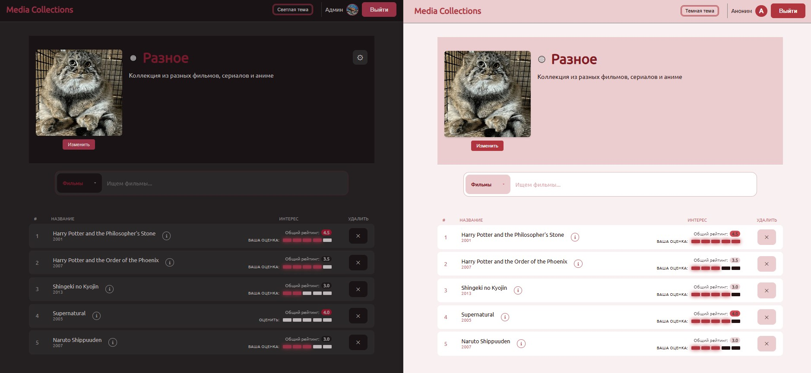
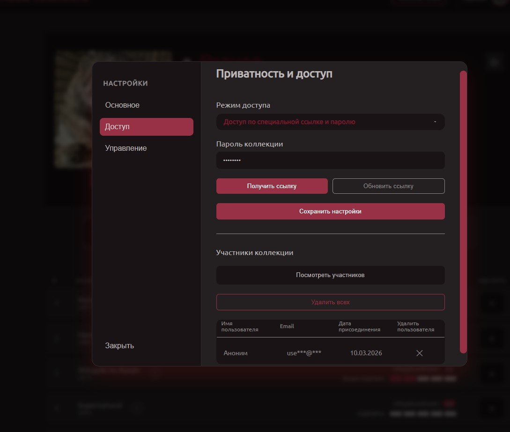

# Media collections // pet project
Полноценный сайт для создания, публикации и совместного использования коллекций с медиа контентом.

# Основные возможности и особенности:
* Создание списков из фильмов, сериалов и аниме. Элементы коллекции имеют средний рейтинг интереса, состоящий из оценок участников;
* **Интеграция с внешним API** (Simkl API) для обширного каталога медиа. База данных пополняется после запроса добавления в коллекцию;
* Разные уровни доступа к коллекциям: закрытые, по паролю, по ссылке с токеном, по ссылке и паролю.
* Аутентификация по JWT-токенам.

Несколько дополнительных скриншотов функционала находятся в директории `documentation/`.

# Стек:
* Бэкенд: FastAPI (SQLAlchemy, Pydantic), FastAPI Websockets.
* Фронтенд: React (JavaScript), html, css.
* База данных: MySQL (aiomysql).
* Прочее: Docker.

# Установка и запуск:

Для полноценного функционала нужен API-ключ от сервиса Simkl (доступ в некоторых регионах, включая РФ, ограничен). Способ получения описан здесь https://simkl.docs.apiary.io/#introduction/getting-started.
Вне зависимости от наличия Secret Key для Simkl API заполните соответствующую переменную в файле `.env`.
Без соединения с внешним API поиск медиа будет происходить только по базе данных проекта.

## Windows.
1. Копировать репозиторий командой `git clone <web URL проекта>`
2. Создать .env файл на основе .env.example
3. Запустить docker-контейнеры: `docker-compose up -d --build`
4. Провести alembic миграции `docker-compose exec backend bash` > `alembic upgrade head`

## Linux.
1. Копировать репозиторий командой `git clone <web URL проекта>`
2. Создать .env файл на основе .env.example: `cd expiry_date` > `cp .env.example .env > nano .env` (отредактируйте .env файл)
3. Запустить docker-контейнеры: `docker-compose up -d --build`
4. Провести alembic миграции `docker-compose exec backend bash` > `alembic upgrade head`

# Примеры API:
`http://localhost:8000/api/docs` — автоматическая документация FastAPI, открывается на порте бэкенда.
`http://localhost/profile` — страница пользователя.
`http://localhost/collections/{ collection_id }` — страница коллекции.

# Futures:
1. [ ] Публичные коллекции: реализовать общую доступность без кликабельных кнопок, возможность присоединяться к коллекции. Лента открытых коллекций.
2. [ ] Система "лайков", отображание лайкнутых коллекций в профиле, выделение "популярных". Апдейт домашней страницы с настоящими коллекциями.
3. [ ] Смена пароля и email, сброс пароля. Подтверждение по коду из письма.
4. [ ] Метрики, тесты.